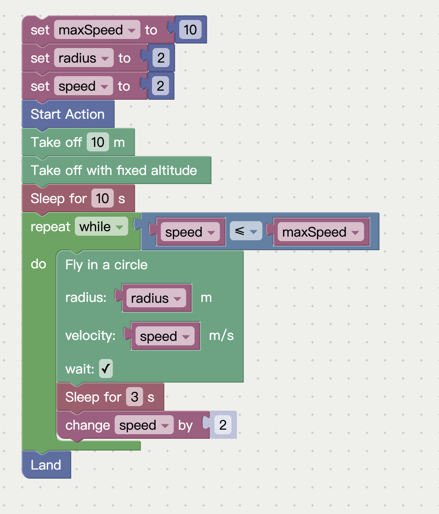
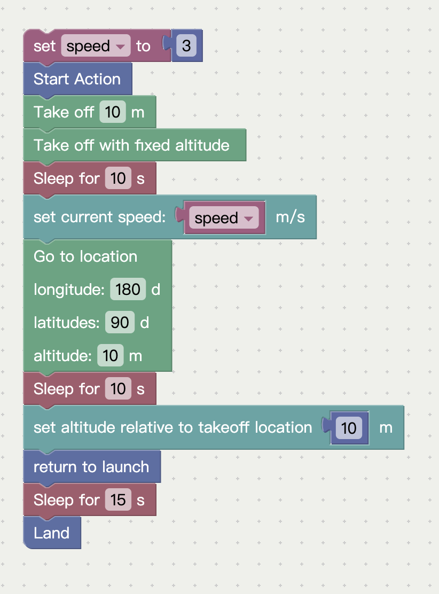
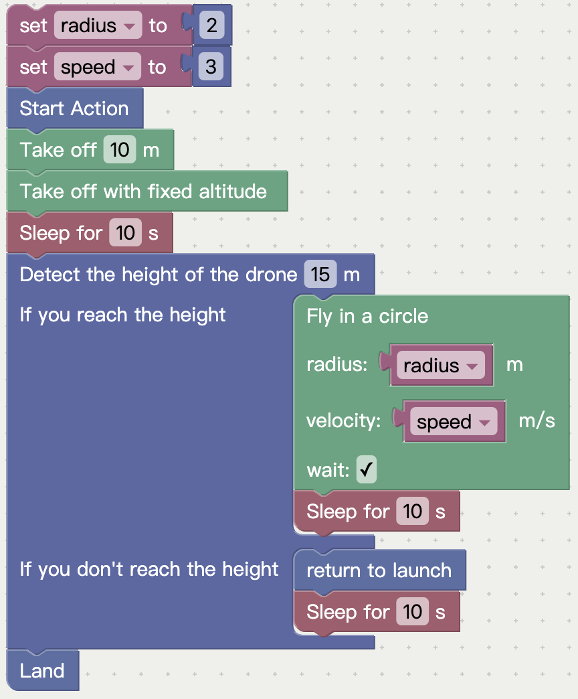
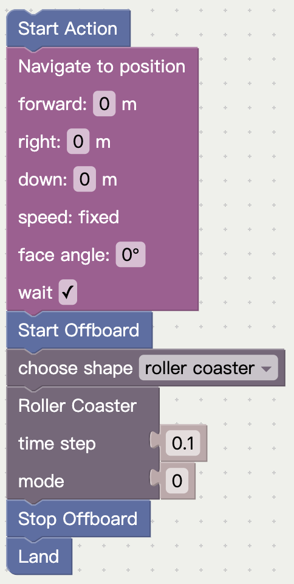
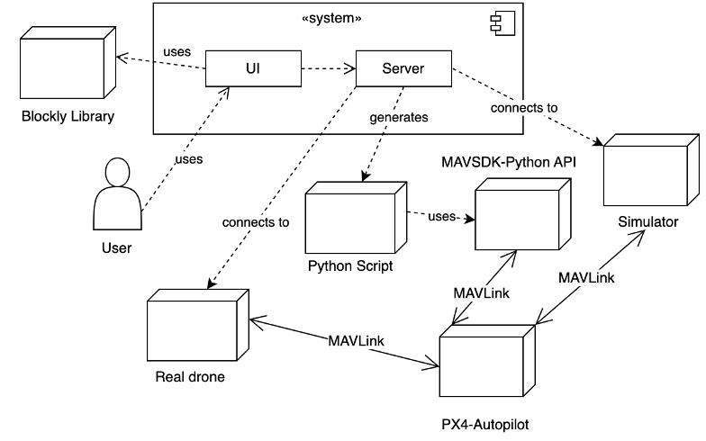

## System Guidelines <a href="https://docs.google.com/document/d/1T7MQbCjDQYi47KPcq6zut38FnCsGzrUq7-UtAqaY5vM/edit?usp=drive_link"></a>

*** 
## ✨ Core Features
- **Visual Programming**: Drag-and-drop blocks for flight logic construction
- **Dual Control Modes**: Combine basic action blocks with CSV path generation
- **Real-Time Simulation**: Integrated jMAVSim/PX4 3D flight visualization
- **Education-First Design**: Built-in error handling with focus on logic building
- **Industrial Compatibility**: MAVLink protocol support for real drones
***

## 📚 Usage Examples

<div style="display: flex; flex-direction: row; gap: 40px;">
  
  
  
  
</div>

***

## 🚀 Installation Guide
### Prerequisites
- macOS/Linux/Windows
- Python 3.11+
- Node.js 18+
- PX4 Autopilot v1.15
### Quick Setup
```bash
# 1. Clone repository
git clone https://github.com/yuwei-jpg/BlockBased_Drone_FYP.git

# 2. Open HTML page and build your path(for macOS)
cd BlockBased_Drone_FYP/html_page
open index.html  

# 3. Clone or download PX4-Autopilot repository
git clone https://github.com/PX4/PX4-Autopilot.git

# 4. Set up the PX4-Autopilot environment
cd PX4-Autopilot
git submodule update --init --recursive

# 5. Check the simulator environment
make px4_sitl jmavsim

# 6. Start the server
cd BlockBased_Drone_FYP/main_scripts
node server.js

# 7. Build up your blocks in website and click the Run Simulator button
```
***
## ❓ FAQ
### How to solve the [qt library issue](https://github.com/PX4/PX4-Autopilot/issues/19146) when opening the simulator? 
```bash
brew uninstall --ignore-dependencies QT
```
### How to solve the block connection errors?
- Check the documentation or send me the questions through email

### How to use the JMAVSim simulation environment?
- Check the [website](https://docs.px4.io/main/en/sim_jmavsim/index.html)

***
## Feedback
* Your feedback is crucial!
* Please contact yuweiji4@gmail.com if you have any problem!
***

## System Design Diagram



